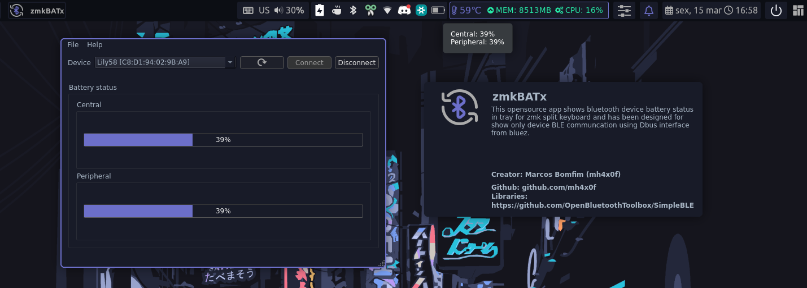

# zmkBATx

**Opensource tool for peripheral battery monitoring zmk split keyboard over BLE for linux.**

## Overview
The **zmkBATx** is opensource app shows bluetooth device battery status in tray for zmk split keyboard and has been designed for show only device BLE communcation using Dbus interface from bluez.

## ZMK config (Peripheral battery monitoring)

If you want to report the battery levels of both sides of a split keyboard, you should have both CONFIG_ZMK_SPLIT_BLE_CENTRAL_BATTERY_LEVEL_PROXY and CONFIG_ZMK_SPLIT_BLE_CENTRAL_BATTERY_LEVEL_FETCHING set to y.
ref: https://zmk.dev/docs/config/battery

## Requirements

* **Linux only**
* **SimpleBluez:** C++ abstraction layer for BlueZ over DBus. (Linux only)
 - https://github.com/OpenBluetoothToolbox/SimpleBLE
* libdbus-1-dev 
* Qt6

## License

**zmkBATx** is licensed under the [MIT](./LICENSE.md).
